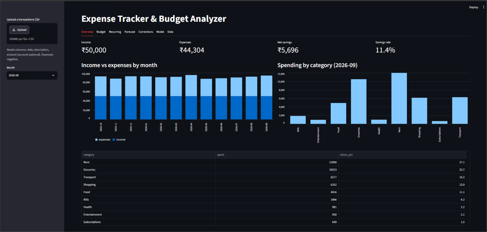

# Automated Expense Tracker & Analyzer

A Python application that imports bank/expense CSV files, cleans and categorizes
transactions, and produces monthly spending insights, budget checks and a
next-month forecast. It has a command-line interface and a Streamlit dashboard.

## How it meets the brief

| Requirement | Where |
|---|---|
| Standard schema: date, description, amount, category, account | `loader.py`, `categorizer.py`, `reports.SCHEMA_COLUMNS` |
| Load with pandas; normalize dates, amounts, merchant names | `loader.py` (ISO and `14/09/2026` dates, `₹1,299` / `(450)` amounts, `UPI/4829/swiggy #12` -> `Swiggy`) |
| Rule-based categorization | `categorizer.py` + `categories.json` |
| Manual corrections | `corrections.csv`, `expense-tracker correct`, dashboard Corrections tab |
| Monthly totals, category shares, recurring expenses, budget variance | `analysis.py` + `budgets.json` |
| Charts / reports and cleaned-dataset export | `reports.py` -> `output/` (4 PNG charts, `report.md`, `clean_transactions.csv`) |
| Tests | `tests/` (29 tests) |
| Logging | `config.py` (console + `logs/expense_tracker.log`) |
| Configuration | `config.json`, `categories.json`, `budgets.json` |
| CLI or Streamlit | both: `cli.py`, `app/streamlit_app.py` |
| Python data prep and modeling | `model.py` (TF-IDF + logistic regression), `forecast.py` (moving average + backtest) |
| Git/GitHub | one commit per stage; see the history with `git log --oneline` |
| Streamlit interface | `app/streamlit_app.py` |

## Quick start (Windows PowerShell)

```powershell
.\setup.ps1
```

This creates `.venv`, installs the package, runs the tests, trains the model and
generates a report. Then:

```powershell
.\.venv\Scripts\activate
streamlit run app/streamlit_app.py            # dashboard  http://localhost:8501
```

Mac/Linux: `python -m venv .venv && source .venv/bin/activate && pip install -e ".[app,dev]"`.

## Command line

```powershell
expense-tracker report                       # charts + cleaned CSV + report.md in output/
expense-tracker report --month 2026-08       # focus on another month
expense-tracker report --input my_bank.csv   # use your own CSV
expense-tracker correct "Dominos Pizza" Food # manual category correction
expense-tracker train                        # compare rules vs model, save the model
expense-tracker forecast                     # next-month forecast + backtest error
```

`python -m expense_tracker <command>` works too.

## Your own data

A CSV with columns `date, description, amount` (and optionally `account`).
Expenses are negative, income is positive. Mixed date formats and duplicates are
handled. Replace the file named in `config.json` or upload it in the dashboard.

## Project structure

```
src/expense_tracker/
  config.py       configuration and logging
  loader.py       read, clean, normalize
  categorizer.py  keyword rules + manual corrections
  model.py        trained classifier and its evaluation
  analysis.py     totals, shares, recurring, budget variance
  forecast.py     moving-average forecast and backtest
  pipeline.py     wires the steps together
  reports.py      charts, export, Markdown report
  cli.py          command line
app/streamlit_app.py   dashboard
scripts/generate_data.py   builds the synthetic labeled dataset
tests/                 pytest suite
data/                  sample_transactions.csv (messy, 16 rows), labeled_transactions.csv (408 rows)
```

## How categorization works

1. **Manual corrections** (`corrections.csv`) always win.
2. **Keyword rules** (`categories.json`) match whole words, so `ola` does not match `Chocolate`.
3. **Trained model** fills only rows the rules could not label, and only when it is
   confident (`min_confidence` in `config.json`). Everything else stays
   `Uncategorized` so you can correct it.

## Results

Measured on the synthetic labeled dataset (408 rows, 12 months, 38 merchants).
It is generated by `scripts/generate_data.py`, so treat these as a check that the
pipeline works, not as real-world accuracy.

| Categorizer test | Keyword rules | Model alone | Rules + model |
|---|---|---|---|
| Merchants also seen in training (102 test rows) | 94.1% | 99.0% | 97.1% |
| Merchants never seen in training (95 test rows) | 83.2% | 33.7% | 83.2% |

- The model reads familiar merchants well, but it cannot know that a new brand name
  like "Amazon" means Shopping. That is why it is used as a fallback and why
  corrections exist. With unseen merchants the model stays quiet and 16.8% of rows are
  left for manual correction rather than guessed wrongly.
- **Forecast backtest** (9 months, each predicted from earlier months only):
  moving average MAE 2,418 (MAPE 5.88%) vs a naive "same as last month" baseline
  MAE 2,460 (MAPE 6.09%). The moving average is only slightly better, which is expected
  for steady synthetic spending.

## Limitations

- Training and evaluation data are synthetic. Real statements will be messier.
- Keyword rules and the model are English and merchant-name based only.
- The forecast is a simple average, not a seasonal model.
- Recurring detection needs the same merchant in 2 or more months.

## Tests

```powershell
pytest
```
